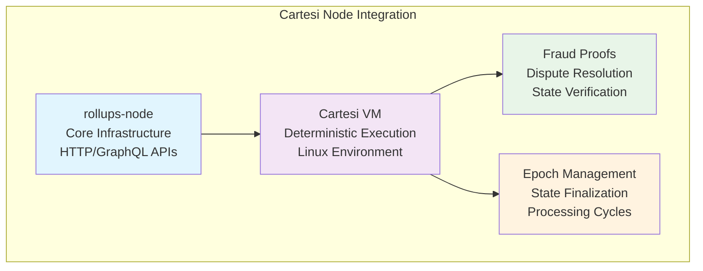
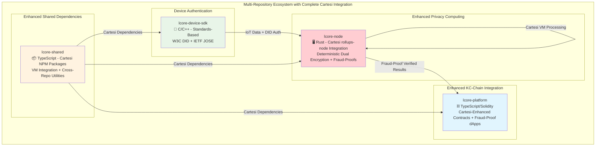
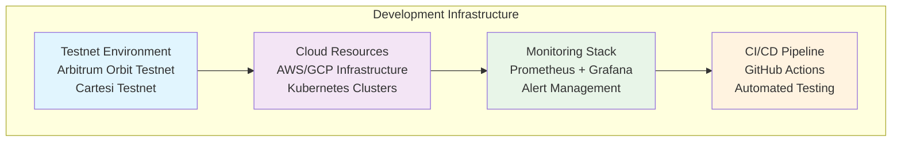
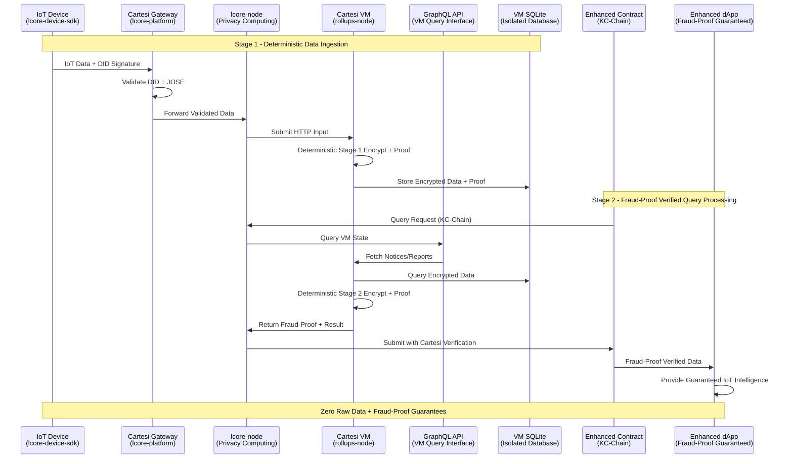
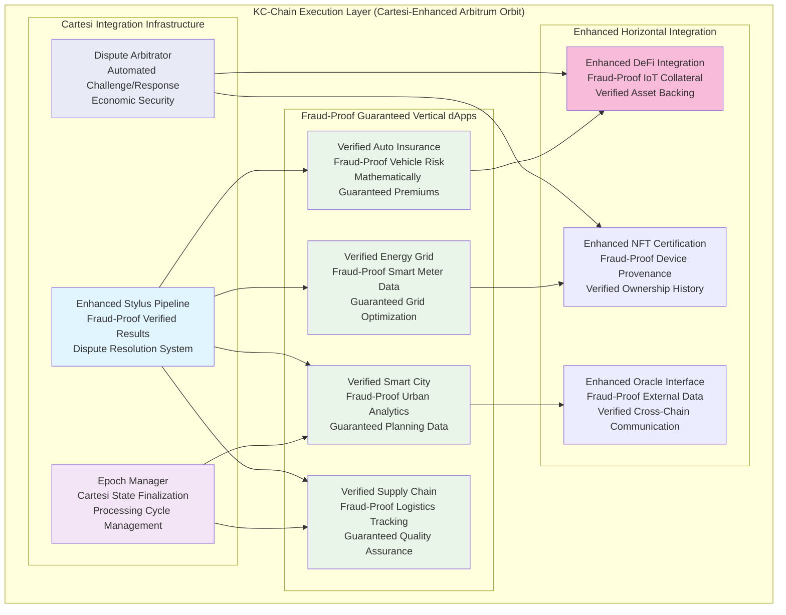
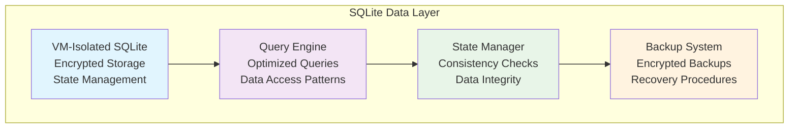
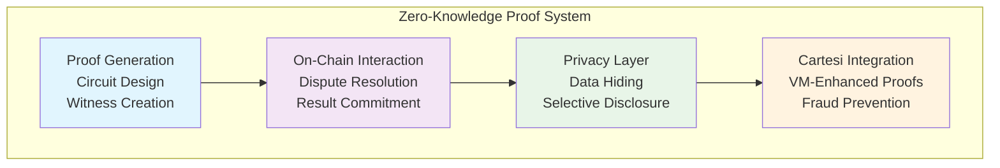
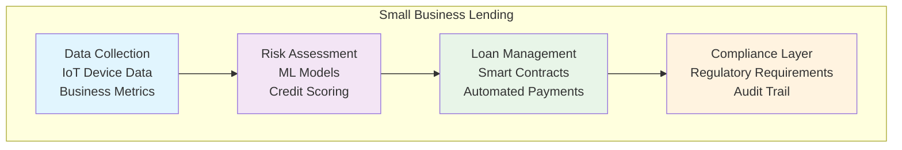
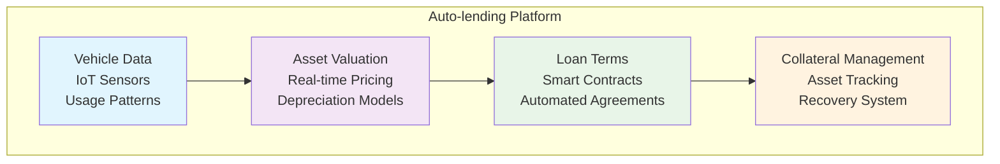
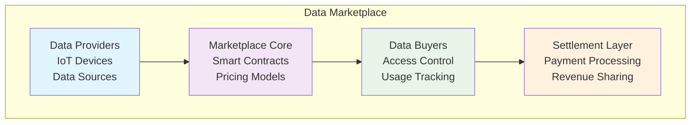

# IoT-L{CORE} SDK Project Structure

## 🔄 **Architecture Evolution: MVP → Complete Cartesi Integration**

This document describes the **complete Cartesi rollups-node integration architecture** with multi-repository dual encryption, following an **MVP-first implementation approach** with migration to full Cartesi integration.

## 🖥️ **Cartesi Node Integration Overview**

### **Core Cartesi Components**


### **Cartesi Integration Points**
1. **rollups-node Integration**
   - HTTP API for input submission
   - GraphQL API for state queries
   - Inspect API for VM state
   - Epoch management system

2. **VM Integration**
   - Deterministic execution environment
   - Linux-based computation
   - State management
   - Fraud proof generation

3. **Fraud Proof System**
   - Dispute resolution
   - State verification
   - Challenge/response mechanism
   - Economic security

4. **Epoch Management**
   - State finalization
   - Processing cycles
   - Performance optimization
   - Load balancing

## 🏗️ **Complete Multi-Repository Architecture with Cartesi Integration**

### **Enhanced Architecture Overview**


## 🏗️ **Development Infrastructure & Resources**

### **Testnet & Cloud Resources**


### **Infrastructure Components**
1. **Testnet Environment**
   - Arbitrum Orbit Testnet Integration
   - Cartesi Testnet Deployment
   - Local Development Network
   - Cross-Chain Test Environment

2. **Cloud Resources**
   - AWS/GCP Infrastructure
   - Kubernetes Clusters
   - Load Balancers
   - Auto-scaling Groups

3. **Monitoring & Observability**
   - Prometheus Metrics Collection
   - Grafana Dashboards
   - Alert Management System
   - Performance Monitoring

4. **CI/CD Pipeline**
   - GitHub Actions Workflows
   - Automated Testing
   - Deployment Automation
   - Security Scanning

## 📋 **Repository 1: `lcore-node`** - Enhanced Privacy Computing with Cartesi

### **Complete Cartesi Integration File Structure**
```
lcore-node/
├── README.md                       # Complete Cartesi integration documentation
├── Cargo.toml                      # Rust workspace with Cartesi dependencies
├── docker-compose.yml              # Development environment with Cartesi VM
├── .env.example                    # Cartesi endpoints and configuration
│
├── src/                            # 🦀 MAIN APPLICATION (Cartesi-Enhanced)
│   ├── main.rs                     # Application entry point with rollups integration
│   ├── config.rs                   # Cartesi configuration management
│   ├── error.rs                    # Enhanced error handling with VM errors
│   └── lib.rs                      # Library exports with Cartesi modules
│
├── cartesi/                        # 🖥️ COMPLETE CARTESI INTEGRATION
│   ├── src/
│   │   ├── vm_client.rs            # Cartesi VM HTTP client
│   │   ├── rollups_integration.rs  # rollups-node HTTP/GraphQL integration
│   │   ├── graphql_client.rs       # GraphQL API for queries and state
│   │   ├── inspect_client.rs       # VM state inspection and debugging
│   │   ├── fraud_proof_handler.rs  # Dispute resolution system
│   │   ├── epoch_manager.rs        # Epoch tracking and finalization
│   │   └── vm_state_manager.rs     # VM state management and synchronization
│
├── encryption/                     # 🔒 VM-ENHANCED DUAL ENCRYPTION
│   ├── src/
│   │   ├── cartesi_stage1.rs       # Stage 1: VM deterministic encryption
│   │   ├── cartesi_stage2.rs       # Stage 2: VM deterministic encryption
│   │   ├── deterministic_proofs.rs # VM-verified proof generation
│   │   ├── fraud_proof_crypto.rs   # Fraud-proof cryptographic operations
│   │   └── vm_key_manager.rs       # VM-isolated key management
│
├── sqlite/                         # 🗄️ VM-ISOLATED DATABASE
│   ├── src/
│   │   ├── vm_sqlite_manager.rs    # Cartesi VM SQLite operations
│   │   ├── deterministic_queries.rs # VM-verified database queries
│   │   ├── encrypted_storage.rs    # VM-isolated encrypted storage
│   │   └── state_verification.rs   # Database state verification
│
├── api/                            # 🌐 CARTESI rollups-AWARE API
│   ├── src/
│   │   ├── rollups_handlers.rs     # HTTP input submission handlers
│   │   ├── graphql_handlers.rs     # GraphQL query handlers
│   │   ├── inspect_handlers.rs     # VM state inspection handlers
│   │   ├── fraud_proof_api.rs      # Dispute resolution API
│   │   └── vm_monitoring.rs        # VM health and performance monitoring
│
├── device/                         # 📱 ENHANCED DEVICE INTEGRATION
│   ├── src/
│   │   ├── cartesi_did.rs          # VM-aware DID validation
│   │   ├── vm_jose.rs              # VM-verified JOSE processing
│   │   └── device_auth.rs          # Enhanced device authentication
│
├── kc_chain/                       # ⛓️ ENHANCED KC-CHAIN INTEGRATION
│   ├── src/
│   │   ├── cartesi_client.rs       # Enhanced KC-Chain RPC client
│   │   ├── fraud_proof_contracts.rs # Fraud-proof contract interfaces
│   │   ├── dispute_resolution.rs   # Dispute resolution system
│   │   └── enhanced_deployment.rs  # Cartesi-enhanced contract deployment
│
├── tests/                          # 🧪 COMPREHENSIVE CARTESI TESTING
│   ├── cartesi_integration/        # Cartesi VM integration tests
│   ├── fraud_proof_testing/        # Dispute resolution tests
│   ├── determinism_testing/        # VM deterministic execution tests
│   ├── vm_performance/             # VM performance and scalability tests
│   └── end_to_end/                 # Complete pipeline testing
│
├── scripts/                        # 📜 CARTESI DEVELOPMENT SCRIPTS
│   ├── deploy-cartesi-vm.sh        # Cartesi VM deployment
│   ├── test-fraud-proofs.sh        # Dispute resolution testing
│   ├── vm-performance-test.sh      # VM performance benchmarking
│   └── deploy-enhanced-contracts.sh # Enhanced contract deployment
│
└── docs/                           # 📚 CARTESI DOCUMENTATION
    ├── cartesi-architecture.md     # Complete Cartesi integration architecture
    ├── fraud-proof-system.md       # Dispute resolution documentation
    ├── vm-integration.md            # VM integration patterns
    └── migration-from-mvp.md       # MVP → Cartesi migration guide
```

**Technology**: Rust
**Purpose**: Enhanced privacy computing with complete Cartesi rollups-node integration
**Key Features**: VM-isolated dual encryption, fraud-proof guarantees, deterministic execution, dispute resolution

## 📱 **Repository 2: `lcore-device-sdk`** - Standards-Based Device Authentication

### **Complete File Structure (Unchanged - No Cartesi Integration Needed)**
```
lcore-device-sdk/
├── README.md                       # Device SDK documentation
├── CMakeLists.txt                  # Build configuration
├── LICENSE                         # MIT license
│
├── core/                           # 🔧 STANDARDS-BASED CORE (10,000+ lines)
│   ├── src/
│   │   ├── dids/                   # W3C DID implementation
│   │   │   ├── did/                # DID core functionality
│   │   │   ├── didcomm/            # DIDComm messaging
│   │   │   └── vc/                 # Verifiable credentials
│   │   ├── jose/                   # IETF JOSE/JWK implementation
│   │   ├── psa/                    # ARM PSA crypto layer
│   │   ├── hal/                    # Hardware abstraction layer
│   │   └── utils/                  # Utilities (JSON, base64, crypto)
│   └── include/                    # Header files
│
├── pal/                            # 🎯 PLATFORM ABSTRACTION LAYER
│   ├── ESP32/                      # ESP32 IoT devices
│   ├── Arduino/                    # Arduino ecosystem
│   ├── Linux/                      # Linux edge devices
│   └── Nordic/                     # Nordic BLE devices
│
├── examples/                       # 📱 PLATFORM EXAMPLES
├── tests/                          # 🧪 COMPREHENSIVE TESTING
├── docs/                           # 📚 DOCUMENTATION
└── scripts/                        # 📜 BUILD SCRIPTS
```

**Technology**: C/C++
**Purpose**: Standards-based device authentication with cross-platform support
**Key Features**: W3C DID, IETF JOSE, ARM PSA crypto, production-ready (10,000+ lines)

## ⛓️ **Repository 3: `lcore-platform`** - Enhanced KC-Chain with Cartesi Integration

### **Complete Cartesi-Enhanced File Structure**
```
lcore-platform/
├── README.md                       # Enhanced platform overview with Cartesi
├── package.json                    # Node.js dependencies with Cartesi packages
├── hardhat.config.ts               # Enhanced KC-Chain deployment with Cartesi
├── docker-compose.yml              # Development environment with Cartesi support
│
├── smart-contracts/                # 🏛️ CARTESI-ENHANCED CONTRACTS
│   ├── cartesi-integration/        # Complete Cartesi integration contracts
│   │   ├── CartesiIoTPipeline.sol  # 🔑 ENHANCED MAIN CONTRACT
│   │   ├── DisputeResolution.sol   # Automatic dispute resolution
│   │   ├── EpochManager.sol        # Cartesi epoch management
│   │   ├── CartesiAccessControl.sol # VM-aware access control
│   │   └── StateValidator.sol      # VM state validation
│   ├── enhanced-dapp-ecosystem/    # Fraud-proof guaranteed dApps
│   │   ├── VerifiedAutoInsurance.sol # Fraud-proof vehicle risk assessment
│   │   ├── VerifiedEnergyGrid.sol  # Fraud-proof smart meter analytics
│   │   ├── VerifiedSmartCity.sol   # Fraud-proof urban planning
│   │   ├── VerifiedSupplyChain.sol # Fraud-proof logistics tracking
│   │   └── VerifiedDeFiConnector.sol # Fraud-proof IoT collateral
│   ├── dispute-resolution/         # Dispute handling infrastructure
│   │   ├── DisputeArbitrator.sol   # Automated arbitration system
│   │   ├── FraudProofValidator.sol # Fraud-proof validation logic
│   │   └── EconomicSecurity.sol    # Staking and slashing mechanisms
│   ├── scripts/                    # Enhanced deployment scripts
│   │   ├── deploy-cartesi.js       # Cartesi integration deployment
│   │   ├── setup-dispute-system.js # Dispute resolution setup
│   │   └── verify-fraud-proofs.js  # Fraud-proof verification
│   └── test/                       # Enhanced contract tests
│       ├── CartesiIntegration.test.js # Cartesi integration tests
│       ├── FraudProofSystem.test.js # Dispute resolution tests
│       └── DeterministicExecution.test.js # VM determinism tests
│
├── cartesi-gateway/                # 🌐 CARTESI rollups-AWARE GATEWAY
│   ├── src/
│   │   ├── controllers/            # Enhanced API controllers
│   │   │   ├── cartesi_inputs.js   # Cartesi VM input submission
│   │   │   ├── graphql_queries.js  # GraphQL query handling
│   │   │   ├── vm_inspection.js    # VM state inspection
│   │   │   └── fraud_proof_monitor.js # Dispute monitoring
│   │   ├── services/               # Enhanced business logic
│   │   │   ├── rollups_client.js   # rollups-node HTTP client
│   │   │   ├── vm_state_manager.js # VM state management
│   │   │   ├── epoch_tracker.js    # Epoch tracking service
│   │   │   └── dispute_handler.js  # Dispute resolution handler
│   │   ├── middleware/             # Enhanced middleware
│   │   │   ├── cartesi_auth.js     # VM-aware authentication
│   │   │   ├── fraud_proof_validation.js # Proof validation
│   │   │   └── vm_rate_limiting.js # VM-aware rate limiting
│   │   └── server.js               # Enhanced Express server
│   ├── tests/                      # Enhanced API tests
│   │   ├── cartesi-integration.test.js # VM integration tests
│   │   ├── fraud-proof-api.test.js # Dispute API tests
│   │   └── deterministic-processing.test.js # Determinism tests
│   └── Dockerfile                  # Enhanced container configuration
│
├── epoch-service/                  # ⏰ CARTESI EPOCH-AWARE ORCHESTRATION
│   ├── src/
│   │   ├── epoch_manager.js        # Cartesi epoch management
│   │   ├── vm_orchestrator.js      # VM processing orchestration
│   │   ├── state_finalizer.js      # State finalization logic
│   │   ├── dispute_monitor.js      # Dispute monitoring service
│   │   └── performance_optimizer.js # VM performance optimization
│   ├── tests/
│   │   ├── epoch-management.test.js # Epoch processing tests
│   │   ├── vm-orchestration.test.js # VM orchestration tests
│   │   └── state-finalization.test.js # State finalization tests
│   └── Dockerfile                  # Container configuration
│
├── fraud-proof-monitoring/         # 📊 FRAUD-PROOF SYSTEM MONITORING
│   ├── src/
│   │   ├── dispute_dashboard.js    # Dispute resolution dashboard
│   │   ├── vm_health_monitor.js    # Cartesi VM health monitoring
│   │   ├── proof_validator.js      # Fraud-proof validation monitor
│   │   ├── economic_monitor.js     # Economic security monitoring
│   │   └── alert_system.js         # Automated alert system
│   ├── prometheus/                 # Enhanced metrics collection
│   ├── grafana/                    # Enhanced dashboard configuration
│   └── alerts/                     # Enhanced alert rules
│
├── cartesi-config/                 # 🖥️ CARTESI CONFIGURATION
│   ├── rollups-config.ts           # rollups-node configuration
│   ├── vm-configuration.ts         # Cartesi VM settings
│   ├── fraud-proof-config.ts       # Dispute resolution settings
│   └── network-endpoints.ts        # Cartesi network endpoints
│
├── shared/                         # 🤝 ENHANCED SHARED UTILITIES
│   ├── cartesi-types/              # Cartesi-specific type definitions
│   ├── fraud-proof-utils/          # Dispute resolution utilities
│   ├── vm-constants/               # VM configuration constants
│   └── deterministic-helpers/      # Deterministic execution helpers
│
├── docs/                           # 📚 ENHANCED DOCUMENTATION
│   ├── cartesi-contracts.md        # Enhanced contract documentation
│   ├── fraud-proof-system.md       # Dispute resolution documentation
│   ├── vm-integration.md           # VM integration guide
│   └── enhanced-deployment.md      # Enhanced deployment instructions
│
└── scripts/                        # 📜 ENHANCED AUTOMATION SCRIPTS
    ├── setup-cartesi-environment.sh # Complete Cartesi setup
    ├── deploy-enhanced-ecosystem.sh # Enhanced ecosystem deployment
    ├── test-fraud-proofs.sh        # Fraud-proof system testing
    └── monitor-disputes.sh          # Dispute monitoring automation
```

**Technology**: TypeScript/Solidity
**Purpose**: Enhanced KC-Chain integration with complete Cartesi fraud-proof system
**Key Features**: Cartesi integration contracts, fraud-proof verification, dispute resolution, enhanced dApps

## 📦 **Repository 4: `lcore-shared`** - Enhanced NPM Packages with Cartesi

### **Complete Cartesi-Enhanced File Structure**
```
lcore-shared/
├── README.md                       # Enhanced shared library documentation
├── package.json                    # Root package.json with Cartesi workspaces
├── lerna.json                      # Enhanced Lerna monorepo configuration
├── tsconfig.json                   # Root TypeScript configuration
│
├── packages/                       # 📦 ENHANCED NPM PACKAGES
│   ├── cartesi/                    # 🖥️ NEW: Complete Cartesi integration
│   │   ├── src/
│   │   │   ├── rollups_client.ts   # rollups-node HTTP/GraphQL client
│   │   │   ├── vm_manager.ts       # Cartesi VM management
│   │   │   ├── fraud_proof_handler.ts # Dispute resolution utilities
│   │   │   ├── epoch_tracker.ts    # Epoch management utilities
│   │   │   ├── state_inspector.ts  # VM state inspection utilities
│   │   │   └── deterministic_utils.ts # Deterministic execution helpers
│   │   └── package.json
│   ├── types/                      # 🔗 ENHANCED SHARED TYPES
│   │   ├── src/
│   │   │   ├── cartesi_types.ts    # Cartesi VM and rollups types
│   │   │   ├── fraud_proof_types.ts # Dispute resolution types
│   │   │   ├── epoch_types.ts      # Epoch and state types
│   │   │   ├── vm_state_types.ts   # VM state management types
│   │   │   ├── iot_data_types.ts   # Enhanced IoT data types
│   │   │   └── enhanced_api_types.ts # Enhanced API contract types
│   │   └── package.json
│   ├── crypto/                     # 🔒 VM-ENHANCED ENCRYPTION
│   │   ├── src/
│   │   │   ├── cartesi_encryption.ts # VM-aware dual encryption
│   │   │   ├── deterministic_proofs.ts # VM-verified proof utilities
│   │   │   ├── fraud_proof_crypto.ts # Fraud-proof cryptographic operations
│   │   │   ├── vm_key_management.ts # VM-isolated key management
│   │   │   └── dispute_crypto.ts   # Dispute resolution cryptography
│   │   └── package.json
│   ├── config/                     # ⚙️ CARTESI CONFIGURATION
│   │   ├── src/
│   │   │   ├── cartesi_endpoints.ts # rollups, GraphQL, inspect endpoints
│   │   │   ├── vm_configuration.ts # VM and epoch settings
│   │   │   ├── fraud_proof_config.ts # Dispute resolution configuration
│   │   │   ├── network_config.ts   # Enhanced network settings
│   │   │   └── monitoring_config.ts # Monitoring and alerting config
│   │   └── package.json
│   ├── testing/                    # 🧪 CARTESI TESTING FRAMEWORK
│   │   ├── src/
│   │   │   ├── vm_test_utilities.ts # Cartesi VM testing utilities
│   │   │   ├── fraud_proof_testing.ts # Dispute resolution testing
│   │   │   ├── determinism_testing.ts # Deterministic execution testing
│   │   │   ├── performance_testing.ts # VM performance testing
│   │   │   ├── integration_testing.ts # Cross-repository testing
│   │   │   └── mock_cartesi_vm.ts  # VM mocking for testing
│   │   └── package.json
│   └── monitoring/                 # 📊 NEW: ENHANCED MONITORING
│       ├── src/
│       │   ├── dispute_monitoring.ts # Dispute resolution monitoring
│       │   ├── vm_performance.ts   # VM performance monitoring
│       │   ├── fraud_detection.ts  # Fraud detection utilities
│       │   ├── economic_monitoring.ts # Economic security monitoring
│       │   └── alert_system.ts     # Automated alert system
│       └── package.json
│
├── libraries/                      # 📚 ENHANCED SHARED LIBRARIES
├── tools/                          # 🛠️ CARTESI DEVELOPMENT TOOLS
├── workflows/                      # 🔄 ENHANCED CI/CD WORKFLOWS
├── docs/                           # 📚 ENHANCED DOCUMENTATION
└── scripts/                        # 📜 ENHANCED MANAGEMENT SCRIPTS
```

**Technology**: TypeScript
**Purpose**: Enhanced cross-repository dependencies with complete Cartesi integration
**Key Features**: Cartesi NPM packages, VM integration utilities, fraud-proof testing framework

## 🔒 **Enhanced Dual Encryption Data Flow with Cartesi**

### **Complete Privacy Pipeline with Fraud-Proof Guarantees**


## ⛓️ **Enhanced KC-Chain Execution Ecosystem with Cartesi**

### **Fraud-Proof Guaranteed dApp Architecture**


## 🔒 **Enhanced Data Architecture: SQLite & zkProofs**

### **SQLite Integration Architecture**


### **zkProofs Integration**


## 🎯 **Targeted Use Cases**

### **1. Small Business Lending**


### **2. Auto-lending**


### **3. Decentralized Data Marketplace**


### **Use Case Implementation Details**

1. **Small Business Lending**
   - IoT device data collection for business metrics
   - ML-based risk assessment and credit scoring
   - Automated loan management through smart contracts
   - Regulatory compliance and audit trail

2. **Auto-lending**
   - Real-time vehicle data collection and monitoring
   - Dynamic asset valuation and pricing
   - Automated loan terms and agreements
   - Collateral management and recovery system

3. **Decentralized Data Marketplace**
   - Secure data provider onboarding
   - Smart contract-based marketplace
   - Access control and usage tracking
   - Automated settlement and revenue sharing 