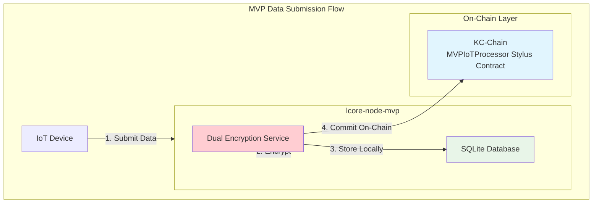
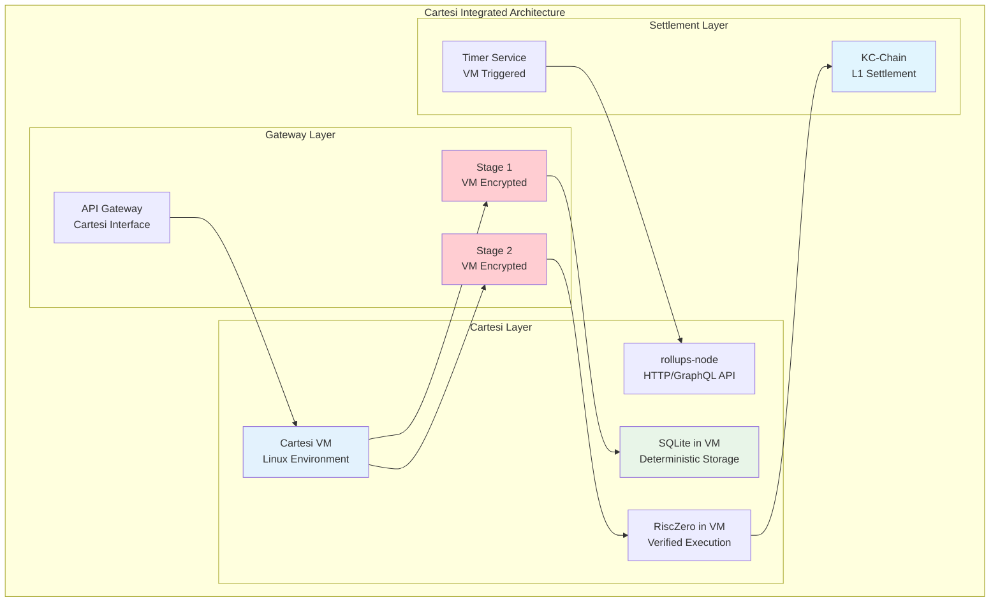

# MVP Migration Path - First Step to Full Cartesi Integration

## 🔄 **Migration Overview**

This document outlines the technical path from MVP implementation to the complete Cartesi rollups-node architecture. The MVP serves as the foundation that we'll migrate to full Cartesi integration.

## 🏗️ **Migration Architecture Progression**

### **Phase 1: MVP Foundation (Current - Weeks 1-8)**


### **Phase 2: Cartesi Integration (Future - Weeks 9-20)**


## 🔧 **Migration Implementation Strategy**

### **Step 1: Abstraction Layer Preparation (Weeks 1-2 of MVP)**

**MVP Code with Migration Interfaces:**
```rust
// Storage abstraction for migration readiness
#[async_trait]
pub trait StorageLayer {
    async fn store_encrypted_data(&self, data: &EncryptedData) -> Result<u64>;
    async fn query_encrypted_data(&self, filters: &QueryFilters) -> Result<Vec<EncryptedRecord>>;
}

// MVP implementation
pub struct MVPSQLiteStorage {
    connection: sqlite::Connection,
}

#[async_trait]
impl StorageLayer for MVPSQLiteStorage {
    async fn store_encrypted_data(&self, data: &EncryptedData) -> Result<u64> {
        // Direct SQLite implementation
        self.connection.execute("INSERT INTO ...", params).await
    }
}

// Cartesi implementation (for future migration)
pub struct CartesiSQLiteStorage {
    cartesi_client: CartesiVMClient,
}

#[async_trait]
impl StorageLayer for CartesiSQLiteStorage {
    async fn store_encrypted_data(&self, data: &EncryptedData) -> Result<u64> {
        // Cartesi VM SQLite operations
        self.cartesi_client.execute_sql("INSERT INTO ...", params).await
    }
}
```

### **Step 2: VM Interface Preparation (Weeks 3-4 of MVP)**

**Execution Environment Abstraction:**
```rust
// Execution environment abstraction
#[async_trait]
pub trait ExecutionEnvironment {
    async fn execute_encryption(&self, request: EncryptionRequest) -> Result<EncryptionResult>;
    async fn execute_query(&self, request: QueryRequest) -> Result<QueryResult>;
}

// MVP implementation
pub struct MVPExecutionEnvironment {
    processor: MVPEncryptionProcessor,
}

#[async_trait]
impl ExecutionEnvironment for MVPExecutionEnvironment {
    async fn execute_encryption(&self, request: EncryptionRequest) -> Result<EncryptionResult> {
        self.processor.process_stage1(&request.data).await
    }
}

// Cartesi implementation (for migration)
pub struct CartesiExecutionEnvironment {
    vm_client: CartesiVMClient,
}

#[async_trait]
impl ExecutionEnvironment for CartesiExecutionEnvironment {
    async fn execute_encryption(&self, request: EncryptionRequest) -> Result<EncryptionResult> {
        // Submit to Cartesi VM for deterministic execution
        self.vm_client.submit_input(&request.serialize()).await
    }
}
```

### **Step 3: Configuration Abstraction (Weeks 5-6 of MVP)**

**Migration-Ready Configuration:**
```rust
// config.rs - Migration-ready configuration
#[derive(Debug, Deserialize)]
pub struct Config {
    pub execution_mode: ExecutionMode,
    pub storage: StorageConfig,
    pub encryption: EncryptionConfig,
    pub kc_chain: KCChainConfig,
}

#[derive(Debug, Deserialize)]
pub enum ExecutionMode {
    MVP { sqlite_path: String },
    Cartesi { 
        vm_endpoint: String,
        rollups_endpoint: String,
    },
}

impl Config {
    pub fn create_storage_layer(&self) -> Box<dyn StorageLayer> {
        match &self.execution_mode {
            ExecutionMode::MVP { sqlite_path } => {
                Box::new(MVPSQLiteStorage::new(sqlite_path))
            }
            ExecutionMode::Cartesi { vm_endpoint, .. } => {
                Box::new(CartesiSQLiteStorage::new(vm_endpoint))
            }
        }
    }
    
    pub fn create_execution_environment(&self) -> Box<dyn ExecutionEnvironment> {
        match &self.execution_mode {
            ExecutionMode::MVP { .. } => {
                Box::new(MVPExecutionEnvironment::new())
            }
            ExecutionMode::Cartesi { vm_endpoint, .. } => {
                Box::new(CartesiExecutionEnvironment::new(vm_endpoint))
            }
        }
    }
}
```

## 📋 **Migration Implementation Steps**

### **Phase 1: Infrastructure Setup (Weeks 9-12)**
- [ ] **Cartesi Node Deployment**: Deploy Cartesi VM infrastructure
- [ ] **rollups-node Integration**: Connect to Cartesi rollups framework
- [ ] **VM Environment**: Configure Linux VM with required dependencies
- [ ] **Network Integration**: Connect Cartesi to KC-Chain

### **Phase 2: Code Migration (Weeks 13-16)**
- [ ] **Storage Layer**: Migrate SQLite operations to Cartesi VM
- [ ] **Encryption Services**: Move dual encryption into VM environment
- [ ] **API Gateway**: Update to use Cartesi rollups APIs
- [ ] **Smart Contracts**: Update for Cartesi settlement patterns

### **Phase 3: Testing & Validation (Weeks 17-18)**
- [ ] **Functional Testing**: All MVP features work in Cartesi
- [ ] **Performance Testing**: Cartesi performance meets requirements
- [ ] **Security Testing**: Deterministic execution verified
- [ ] **Integration Testing**: End-to-end pipeline validation

### **Phase 4: Deployment (Weeks 19-20)**
- [ ] **Production Deployment**: Cartesi infrastructure live
- [ ] **Data Migration**: Transfer existing encrypted data
- [ ] **Monitoring Setup**: Cartesi-specific monitoring
- [ ] **Documentation**: Complete migration documentation

## 🔄 **Rollback Strategy**

### **Dual-Mode Operation During Migration**
```rust
// Support both MVP and Cartesi during transition
#[derive(Debug, Deserialize)]
pub enum ExecutionMode {
    MVP,
    Cartesi,
    DualMode { primary: Box<ExecutionMode> },
}

pub struct DualModeProcessor {
    mvp_processor: MVPProcessor,
    cartesi_processor: CartesiProcessor,
    mode: ExecutionMode,
}

impl DualModeProcessor {
    pub async fn process_data(&self, data: &IoTData) -> Result<ProcessingResult> {
        match &self.mode {
            ExecutionMode::MVP => self.mvp_processor.process(data).await,
            ExecutionMode::Cartesi => self.cartesi_processor.process(data).await,
            ExecutionMode::DualMode { primary } => {
                // Run both systems and compare results during transition
                let (mvp_result, cartesi_result) = tokio::join!(
                    self.mvp_processor.process(data),
                    self.cartesi_processor.process(data)
                );
                
                match primary.as_ref() {
                    ExecutionMode::MVP => mvp_result.or(cartesi_result),
                    ExecutionMode::Cartesi => cartesi_result.or(mvp_result),
                    _ => unreachable!(),
                }
            }
        }
    }
}
```

## 📈 **Migration Success Metrics**

### **Technical Metrics**
- **Deterministic Execution**: 100% reproducible results
- **Performance**: Maintain MVP performance levels
- **Reliability**: 99.9% uptime during migration
- **Data Integrity**: Zero data loss during migration

### **Functional Metrics**
- **Feature Parity**: All MVP features working in Cartesi
- **Integration**: KC-Chain integration functioning
- **Automation**: Timer service working with Cartesi
- **Device Support**: All ioID-SDK devices working

This migration path provides a clear technical progression from MVP to full Cartesi integration, maintaining the core dual encryption architecture throughout the process. 